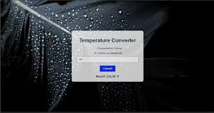
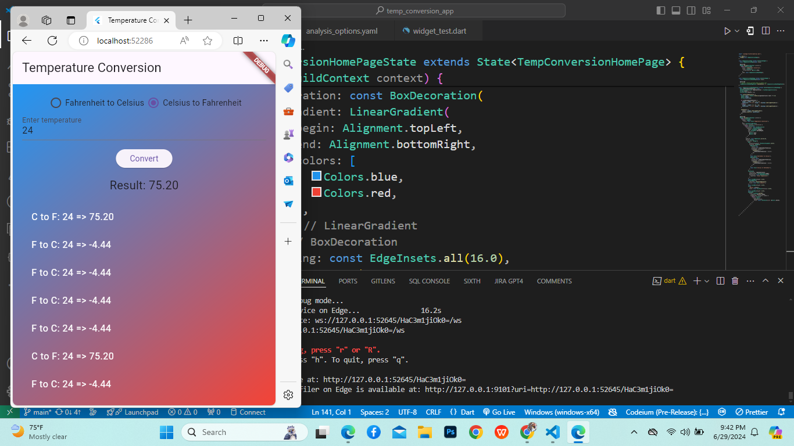

# Temperature Conversion App

A simple Flutter application for converting temperatures between Fahrenheit and Celsius, with user authentication features.

## Features

- **Temperature Conversion:** Convert temperatures from Fahrenheit to Celsius and vice versa using standard formulas.
- **User Authentication:** Secure login and signup functionality using Firebase Authentication.
- **Conversion History:** View a history of temperature conversions performed during the session.
- **Responsive Design:** Supports both portrait and landscape orientations.


## Installation

1. Ensure you have Flutter installed. If not, follow the [Flutter installation guide](https://flutter.dev/docs/get-started/install).
2. Clone this repository.
   ```bash
   git clone https://github.com/your-username/temp_conversion_app.git
   ```
3. Navigate to the project directory and run:
   ```bash
   flutter pub get
   ```
4. Input Temperature:
The user provides a temperature value in a specific unit (e.g., Celsius, Fahrenheit, or Kelvin).
Selection of Conversion Type:

The user selects the desired conversion type (e.g., Celsius to Fahrenheit, Fahrenheit to Kelvin, etc.).
Application of Conversion Formula:

Based on the selected conversion type, the temperature converter applies the appropriate mathematical formula to perform the conversion. Here are the common formulas used:
Celsius to Fahrenheit: 
𝐹
=
(
𝐶
×
9
5
)
+
32
F=(C× 
5
9
​
 )+32
Fahrenheit to Celsius: 
𝐶
=
(
𝐹
−
32
)
×
5
9
C=(F−32)× 
9
5
​
 
Celsius to Kelvin: 
𝐾
=
𝐶
+
273.15
K=C+273.15
Kelvin to Celsius: 
𝐶
=
𝐾
−
273.15
C=K−273.15
Fahrenheit to Kelvin: 
𝐾
=
(
𝐹
−
32
)
×
5
9
+
273.15
K=(F−32)× 
9
5
​
 +273.15
Kelvin to Fahrenheit: 
𝐹
=
(
𝐾
−
273.15
)
×
9
5
+
32
F=(K−273.15)× 
5
9
​
 +32
Output Temperature:

The converted temperature is displayed in the chosen unit.
Example:
Convert 25°C to Fahrenheit:

Input Temperature: 25°C
Selection of Conversion Type: Celsius to Fahrenheit
Application of Conversion Formula:
𝐹
=
(
25
×
9
5
)
+
32
F=(25× 
5
9
​
 )+32
𝐹
=
45
+
32
F=45+32
𝐹
=
77
F=77
Output Temperature: 77°F
This process can be implemented in various forms, including:

Manual Calculation: Using the formulas to calculate the conversion by hand.
Digital Tools: Using calculators, mobile apps, or online converters to perform the conversion automatically.
Embedded Systems: Temperature sensors and devices with built-in conversion algorithms to provide real-time temperature readings in different units
  

5. Run the app:
   ```bash
   flutter run
   ```

## Screenshots



## Contributing

Contributions are welcome! Fork this repository, make your changes, and submit a pull request.

## License

This project is licensed under the MIT License - see the [LICENSE](LICENSE) file for details.

---

Adjust paths, screenshots, and details as per your project's actual setup and preferences. This README provides a concise overview of your app, its features, installation instructions, and how others can contribute.
