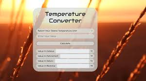

# Temperature Conversion App

A simple Flutter application for converting temperatures between Fahrenheit and Celsius, with user authentication features.

## Features

- **Temperature Conversion:** Convert temperatures from Fahrenheit to Celsius and vice versa using standard formulas.
- **User Authentication:** Secure login and signup functionality using Firebase Authentication.
- **Conversion History:** View a history of temperature conversions performed during the session.
- **Responsive Design:** Supports both portrait and landscape orientations.


## Installation

1. Ensure you have Flutter installed. If not, follow the [Flutter installation guide](https://flutter.dev/docs/get-started/install).
2. Clone this repository.
   ```bash
   git clone https://github.com/your-username/temp_conversion_app.git
   ```
3. Navigate to the project directory and run:
   ```bash
   flutter pub get
   ```
4. Configure Firebase:
   - Set up Firebase project in the Firebase console.
   - Add `google-services.json` for Android or `GoogleService-Info.plist` for iOS to the appropriate location in your project.
   - Enable Email/Password authentication method in Firebase Authentication.

5. Run the app:
   ```bash
   flutter run
   ```

## Screenshots


## Contributing

Contributions are welcome! Fork this repository, make your changes, and submit a pull request.

## License

This project is licensed under the MIT License - see the [LICENSE](LICENSE) file for details.

---

Adjust paths, screenshots, and details as per your project's actual setup and preferences. This README provides a concise overview of your app, its features, installation instructions, and how others can contribute.